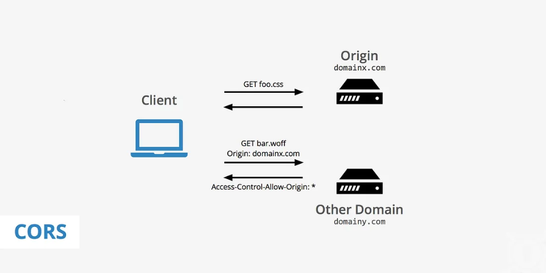

## WeBook

### Login

对于一个用户模块来说，最先要设计的接口就是：**注册 & 登录 Registration & Login**。之后再考虑编辑/查看用户信息。

定义 UserHandler 将所有和用户有关的路由都定义在了这个 Handler 上，同时定义方法注册路由到 Engine 中。

**采用分散注册使 main 简洁。使用分组注册避免 path 写错。**

```bash
.
├── internal         # 业务代码
│   └── web
│       └── user.go
├── main.go          # 入口
└── pkg              # 归档
```

:warning: http://localhost:3000/users/signup

```bash
$ git clone https://gitee.com/geektime-geekbang_admin/geektime-basic-go.git
$ git checkout week3
$ cd webook-fe
$ npm install
$ npm run dev
```

:construction_worker: 需要和前端确认是用什么格式进行数据传输的，比如 JSON | XML

使用一个结构体来封装来向请求，通过 `Bind[Content-Type]` 进行反序列化。

```go
type SignUpReq struct {
	Email    string `json:"email"`
	Password string `json:"password"`
}

var req SignUpReq
if err := c.BindJSON(&req); err != nil {
	return
}
```

:construction_worker: 校验什么字段、怎么校验，理论上由产品经理决定，即便前端进行了校验，但还是不能完全信任，后端还是要有保障。

:construction_worker: Go 原生的 regex 库支持有限，使用 `regexp2`。Handler 构造器中编译好 regex 提高性能，而不是每次访问的时候都要编译。

```go
type UserHandler struct {
	emailRegexp    *regexp.Regexp
	passwordRegexp *regexp.Regexp
}

func NewUserHandler() *UserHandler {
	// regex pattern const, scope control
	const (
		emailRegexPattern    = "^[a-zA-Z0-9._%+-]+@[a-zA-Z0-9.-]+\\.[a-zA-Z]{2,}$"
		passwordRegexPattern = "^(?=.*[A-Z])(?=.*[a-z])(?=.*\\d)(?=.*[@#$%^&+=]).{8,}$"
	)
	emailRegexp := regexp.MustCompile(emailRegexPattern, regexp.None)
	passwordRegexp := regexp.MustCompile(passwordRegexPattern, regexp.None)
	return &UserHandler{
		emailRegexp:    emailRegexp,
		passwordRegexp: passwordRegexp,
	}
}
```

### Middleware

中间件 AKA plugin/handler/filter/interceptor → **AOP 解决方案：所有业务都关联的逻辑处理进行抽离**，比如：AuthN & AuthZ, Logging, Monitoring。

**Request → []middleware → Business Logic**

```go
// 注册 middleware，可传入多个 HandlerFunc
func (engine *Engine) Use(middleware ...HandlerFunc) IRoutes
// type redef, func as type
type HandlerFunc func(*Context)
```

```go
s := gin.Default()	

// ordered
s.Use(func(c *gin.Context) {
	fmt.Println("1st middleware")
})

s.Use(func(c *gin.Context) {
	fmt.Println("2nd middleware")
})
```

### CORS

跨域问题：由浏览器的**同源策略（Same-Origin Policy）**引起的，该策略要求浏览器只允许页面加载来自同一域的资源，以**防止恶意网站获取用户的敏感信息**。

```bash
Access to XMLHttpRequest at 'dst' from origin 'src' has been blocked by CORS policy：
Response to preflight request does not pass access control check:
No 'Access-Control-Allow-Origin' header is present on the requested resource.
```

**跨域资源共享 Cross-Origin Resource Sharing**

:construction_worker: 浏览器通过 preflight 请求 HTTP OPTIONS 询问 dst 是否可以接受 src 的请求。

:construction_worker: dst 需要在 preflight 响应中 ++headers: `Access-Control-[Allow-Origin|Allow-Headers|Allow-Metods]`。

:bookmark_tabs: Middleware: [gin-gonic/contrib](https://github.com/gin-gonic/contrib) → [CORS](https://github.com/gin-contrib/cors)





**CORS 通过**：浏览器会返回客户端 204 No Content 即 dst 允许 src 的来向请求。

```go
s.Use(cors.New(cors.Config{
    // AllowOrigins: []string{"*"}                            // better not
    AllowOrigins: []string{"http://localhost:3000"},          // 指定允许跨域请求的来源
	AllowMethods: []string{"POST", "GET"},                    // 指定允许的 HTTP 方法
	AllowHeaders: []string{"Content-Type", "Authorization"},  // 定允许跨域请求中携带的请求头部
	ExposeHeaders: []string{"Content-Type", "Authorization"}, // 指定服务器允许暴露给客户端的响应头部
	AllowCredentials: true,                                   // 指定是否允许跨域请求携带认证信息 like Cookie
	AllowOriginFunc: func(origin string) bool {
		// dev
        if strings.HasPrefix(origin, "http://localhost") {
			return true
		}
        // prod
		return strings.Contains(origin, "company.domain.name.com")
	},
	MaxAge: 12 * time.Hour,                                   // preflight 有效期
}))
```

```go
// cors.go → config.go
if c.Request.Method == "OPTIONS" {
	cors.handlePreflight(c)
	defer c.AbortWithStatus(cors.optionsResponseStatusCode) // 204
}
```

### mysql

```yaml
version: '3.8'

# https://hub.docker.com/_/mysql
services:
  mysql:
    image: mysql:9.0
    restart: always
    environment:
      MYSQL_ROOT_PASSWORD: root
    networks:
      local:
        ipv4_address: 192.168.80.10
    ports:
      - "13306:3306"
    volumes:
      - ./script/mysql/:/docker-entrypoint-initdb.d/

networks:
  local:
    external: true
```

```bash
$ docker compose up
$ docker compose down
```

### Project Layout

:confused: **DB CRUB where to put?** Definitely not in UserHandler which only deals with HTTP req & res.

:smile: **领域驱动设计 Domain-Driven Design，DDD**

- Service - Repository - **DAO → 设计模式，用于将应用程序的业务逻辑和数据库操作相互分离，封装接口访问 DB 执行 CRUD**
- 界限模糊：Address 属于 User 的子域，但随着用户规模的增大，Address 会独立成一个新的领域。
- 方法论：先明确业务中的领域，再去进行系统设计。

```go
internal
├── domain     // 领域，业务对象，或者现实对象在程序中的行为表现
├── repository // 领域对象存储，抽象整体，不代表 DB
│   └── dao    // Data Access Object
│   └── cache  // Cache
├── service    // 领域服务 = 一个业务的完整处理过程抽象，组合 repository & domain 以及其他 service
└── web
    └── user.go
```

